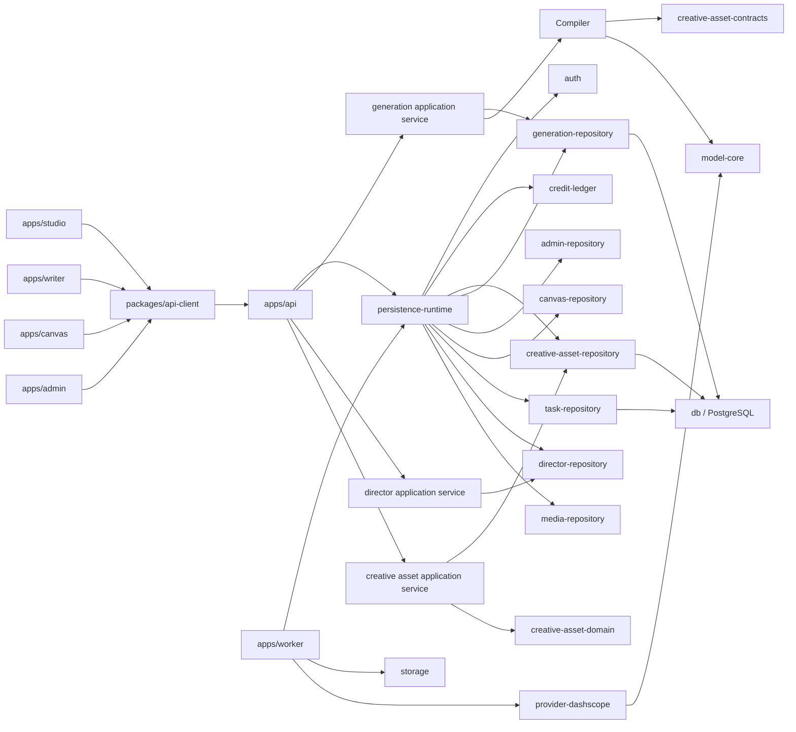

# 短剧素材平台目标架构

## 1. 文档状态

| 状态 | 含义 |
| --- | --- |
| 已确认 | 当前仓库、用户产品边界或个人规范已经明确的事实 |
| 目标 | 后续重构完成后应达到的边界 |
| 迁移中 | 已有实现可以工作，但还没有达到目标边界 |
| 未实现 | 本文只定义方向，尚未修改代码 |
| 待确认 | 会影响包边界、数据迁移或公开契约的最小决策 |

本文是创意资产平台的架构基线。它只负责“主体、场景、道具、风格和参考图等可复用素材”，不负责整条短剧的节奏、镜头取舍、剪辑和最终合片。

## 2. 结论摘要

### 已保留的仓库级选择

- **采用 `bun + Node 24 + Turborepo`**：仓库使用 `bun@1.4.0` 和 `bun.lock` 管理 workspace；API 由 Bun 启动，Worker 和脚本使用 Node 24。
- **前端按职责拆分为 `apps/studio`、`apps/writer`、`apps/canvas`、`apps/admin`**：四个 app 通过同源路径部署，共享 API client、认证层和 UI 原语。
- **保留 PostgreSQL + Docker Compose**：项目是多进程、需要历史/恢复/审计的服务，当前数据库和迁移链路已经运行，不改成 SQLite。
- **保留 Biome、Elysia、Drizzle、Zod 和现有 Vitest**：现有工具链已经形成稳定约定；测试 runner 后续可以按领域逐步评估 Bun test，但本次不做全仓库迁移。

### 必须调整的边界

1. API 路由不再直接编排 `creative-asset-repository`，增加资产域 use case/service 层。
2. 创意资产协议不再继续扩张到万能的 `@bailian-studio/shared`；新边界使用明确的 `creative-asset-contracts` 和纯规则包。
3. 资产选择和模型能力适配由独立的纯函数 compiler 负责，不能塞进 API 路由、数据库 repository 或 DashScope provider。
4. 生成提交时固化“资产版本 + 参考图 + 模型能力 + 映射结果”的不可变快照；Worker 只消费快照，不在重试时重新读取用户当前资产版本。
5. Provider 仍然只负责协议执行、请求/响应解析和错误分类，不拥有资产语义，也不直接访问数据库。

## 3. 目标依赖关系



### 依赖规则

- `apps/api` 可以依赖 repository、domain、compiler 和 api-client contracts，但不能依赖 `db` 或 provider。
- `apps/worker` 可以依赖 generation repository、task-repository、storage、model-core 和 provider runner，但不能依赖 API 或直接访问 `db`。
- `creative-asset-domain` 和 `creative-asset-compiler` 不读取环境变量、不访问数据库、不发 HTTP、不启动 listener。
- `creative-asset-repository` 只负责资产域持久化、事务和数据库不变量；不负责 HTTP、Provider、UI 和 prompt 编排。
- `admin-repository` 只负责后台治理读模型和运营分析 port；不再由 generation repository 对外转发。
- `canvas-repository` 负责用户画布文档、当前快照、不可变版本和 revision 并发控制；Canvas 节点引用资产 ID，临时 read URL 不入库。
- `provider-dashscope` 不依赖资产 repository、generation repository、Worker 或 API；资产输入必须已经被编译成 provider-neutral 的生成输入。
- `apps/studio`、`apps/writer`、`apps/canvas`、`apps/admin` 只通过 `packages/api-client` 访问 API，不 deep-import repository、db 或 app 源码。

### 3.1 进程级数据库生命周期（已实现）

- API 和 Worker 的组合根通过 `@bailian-studio/persistence-runtime` 各自只创建一个
  PostgreSQL/Drizzle 句柄，再把同一实例注入 generation、director、creative-asset、
  media、task、auth 和 credit 边界。
- 只有创建句柄的组合根负责关闭连接池。各 repository/service 不拥有也不重复关闭共享池。
- 生成事件的 `LISTEN/NOTIFY` 仍使用独立长连接；它是通知传输，不是第二套业务查询连接池。
- `create…FromUrl` 仍保留给独立包测试和单模块工具；API/Worker 进程入口不再为每个模块
  调用一个 URL 工厂。
- generation 的 application service 由 API 组合根创建并注入，统一承接估价、提交、取消和重试；
  路由不再分别编排这些写入/状态转换流程。
- gallery/social 的 API 路由已改为依赖窄 `SocialRepository` port；SQL 已物理归档在
  `generation-repository/src/social.ts`，后续可在不改路由的情况下移动到独立 social repository。
- 通知收件箱、已读状态和点赞/收藏通知编排已改为依赖窄 `NotificationRepository` port；
  SQL 位于 `generation-repository/src/notifications.ts`。
- 提示词库、用户反馈和内容举报分别依赖 `PromptLibraryRepository`、`FeedbackRepository`、
  `ContentReportRepository`；SQL 已归档到对应模块，API 组合根负责实例化和注入。
- admin gallery 的治理/预览依赖 `AdminGalleryRepository`，SQL 已物理迁移到
  `packages/admin-repository/src/admin-gallery.ts`；举报后的隐藏动作由 API 显式调用该 port。
- admin 任务中心与成本/留存分析分别依赖 `AdminTaskRepository`、`AnalyticsRepository`，
  SQL 已物理迁移到 `packages/admin-repository/src/admin-tasks.ts` 与 `analytics.ts`；
  admin 任务是跨 users/generation/assets 的只读运营投影，不迁入任务生命周期包。
- 内容域方法已从 `GenerationRepository` 核心接口移除；URL 工厂/隔离测试句柄分别暴露
  核心 repository 与各域窄 port，仓储测试按窄 port 组合 harness。
- 资产路由与分享路由分别依赖 `AssetRepository`、`ShareRepository` / `PublicShareRepository`；
  SQL 已归档到 `generation-repository/src/assets.ts` 与 `shares.ts`，核心
  `GenerationRepository` 不再暴露这些方法。
- API 审计通过独立 `AuditRepository` port 注入；约 115 个审计调用已不再把完整
  `GenerationRepository` 作为横切能力传入，审计失败仍保持 best-effort。审计写入 SQL
  已物理归档到 `generation-repository/src/audit-events.ts`，核心 generation repository 不再转发。
- Worker 的 provider 出站请求审计通过 `ProviderRequestAuditRepository` 注入，SQL 写入
  位于 `generation-repository/src/provider-requests.ts`；generation 详情仍可读取
  provider 请求投影，但 Worker 不再从 GenerationRepository 核心接口写审计。
- 生成详情诊断通过独立的 `GenerationDiagnosticsRepository` 提供安全读投影；它可以联合读取
  generation、task 和 provider request 记录，但不参与 generation 状态迁移或 Worker 任务生命周期。
- 用户用量接口通过 `UsageRepository` 读取，调用统计由 `AnalyticsRepository` 读取；相关
  聚合 SQL 分别位于 `usage.ts` 与 `analytics.ts`，避免报表/用量查询继续扩大 generation
  生命周期接口。生成应用服务的每日限额预检也通过显式的 `UsageRepository` 注入完成，
  `GenerationRepository` 核心接口不再承载用量读模型；URL 工厂/隔离测试句柄直接暴露
  `UsageRepository`。
- director 的 application service 由 API 组合根创建并注入，统一承接阶段运行的估价、预检、
  视频/音乐/合成运行创建和单镜头重试；Worker 继续负责异步 Provider 调用与运行状态推进。

### 3.2 任务队列生命周期（已完成，2026-08-30）

- `@bailian-studio/task-engine` 只拥有纯状态机；`@bailian-studio/task-repository` 拥有
  `task_records` 的 claim、租约续期、状态保存和读取，以及 Drizzle 行映射。
- `apps/worker` 通过 `persistence-runtime` 接收 `claim/renew/save` 最小 port；
  generation repository 不再承担任务生命周期 port。
- generation/media/director 的业务 repository 由持久化组合根注入同一个
  `TaskQueueTransactionStore`，但仍各自开启“业务记录 + 初始任务”事务；任务包只负责事务内的
  task row 写入、窄查询和任务状态转换，不负责跨域事务的开启与提交。
- generation 详情诊断由 `GenerationDiagnosticsRepository` 单独承载，核心
  `GenerationRepository` 只保留生成状态与业务事务能力。
- Worker 的陈旧 generation 清扫通过独立的 `GenerationRecoveryRepository` 读取；恢复读模型
  与生成核心状态写入分离，Worker 仍显式调用核心 repository 完成最终失败收口。

### 3.3 Canvas 执行生命周期（已实现，2026-08-30）

- Canvas 的编辑快照和执行状态分离：`canvas_documents` / `canvas_document_versions` 只保存
  用户编辑内容；`canvas.execute` 任务输入保存一次编译后的 plan 和可恢复的 `nodeRuns` 游标。
- API 以当前 `revision` 编译 React Flow DAG，拒绝未知节点、环路、不可用模型、模型类型不匹配、
  缺失/越权素材和不支持的媒体输入；任务提交以 `(user, canvas, idempotencyKey)` 的确定性任务 ID
  提供幂等边界。
- Worker 按拓扑顺序推进节点；同一依赖层的就绪节点会并行创建 generation，默认并发上限为 4，
  可由 Worker 组合根调整。每个 Canvas 媒体节点都通过现有 `GenerationRepository` 创建普通
  generation，因此继续复用额度预留、provider 审计、artifact 持久化和资产投影；上游节点只向下游
  传递稳定的 `asset_generation_*` ID。
- Canvas worker 会等待 artifact persist 完成并确认 user asset 投影 ready 后才推进下游；不会把
  provider 临时 URL 写入任务或画布快照。每个节点仍以可恢复的 `nodeRuns` 状态推进，并默认每个
  上游节点向下游提供第一个输出资产。
- 用户可以取消仍处于 queued/running 的整张 Canvas 任务；任务状态会原子地变为 cancelled、释放租约，
  并尽力向已创建的子 generation 发出取消请求。Provider 是否已经停止执行由现有 generation/provider
  生命周期决定，因此取消接口不承诺已发出的外部请求能够瞬时中断。
- Canvas 执行状态通过 `GET /api/canvases/:id/executions/:taskId/events` 提供 SSE；API 只读取
  `task_records` 的变化并推送最新完整快照，避免引入第二份运行状态。客户端以 SSE 为主，连接不可用时
  降级为原有任务查询轮询，终态事件发送后关闭连接。
- 用户可以通过 `POST /api/canvases/:id/executions/:taskId/nodes/:nodeId/retry` 从一条已结束的执行派生新任务；
  新任务保留成功节点的稳定资产结果，只将目标节点及其下游置回 `queued`。失败任务中的其它失败分支也会
  一并失效，取消任务中的非成功节点不会被复用。原任务保持不可变，接口使用幂等键保护派生任务创建。
- Canvas 页面已提供选中节点后的“重跑节点”入口，并复用同一条 SSE/轮询跟踪链路；因此节点级重跑不会
  另起一套前端状态机。
- 普通 Canvas 执行会按 `modelManifestHash + params + resolvedAssetRefs` 生成版本化节点缓存键，复用同一
  用户下成功且未软删除的 generation 幂等结果；缓存命中不重复创建 generation，也不重复扣费。失败/取消
  的旧缓存会自动降级为本次任务的 fresh key，节点级手动重跑固定使用 `refresh` 策略。
- Canvas 执行历史通过 `GET /api/canvases/:id/executions` 从 `task_records` 读取，不新增第二份运行态表；
  查询由 `task-repository.listTasks` 提供用户隔离的 keyset 分页，并同时按新任务的 `recordId` 与旧任务输入中的
  `documentId` 保持兼容。前端可点击历史记录，重新读取执行摘要和稳定资产结果来恢复节点预览。
- 生成仓储对幂等创建显式返回是否 `reused`；Canvas Worker 把该结果写入节点 `nodeRuns.cacheHit`，并通过
  `worker.canvas.node_cache` 暴露 hit/miss 计数。API 历史摘要和 Canvas 运行记录面板只投影这个可恢复字段，
  不把缓存命中误作 generation 已完成，也兼容尚未带该字段的历史任务。
- Canvas 节点的静态参考素材同时保存 `referenceAssetIds` 与 `referenceAssetKinds`；前端选择器按照当前模型的
  media 参数请求允许的图片/视频资产，编译器仍在服务端用资产实际 kind 做最终校验。节点输出类型与参考输入类型
  不再被错误绑定，首尾帧、图生视频和图像编辑等多输入模型可以共享同一选择器契约。

## 4. 领域模型归属

| 概念 | 所属 | 语义 | 不负责什么 |
| --- | --- | --- | --- |
| `user_assets` | 物理媒体域 | 实际上传/生成的图片、视频、音频或文件 | 不表达“这是哪个角色” |
| `creative_assets` | 创意资产域 | 角色、场景、道具、风格等可复用语义实体 | 不等于单张图片 |
| `creative_projects` | 素材组织域 | 用户整理素材的项目/IP/短剧工作区 | 不负责剪辑时间线和镜头节奏 |
| `creative_project_assets` | 素材组织域 | 项目与资产的多对多归类关系 | 不代表资产所有权 |
| `creative_asset_versions` | 创意资产域 | 资产语义和生成配方的不可变版本 | 不原地覆盖已使用版本 |
| `creative_asset_references` | 参考资料域 | 版本所绑定的实际图片及其语义 role | 不依赖文件名和 UI 数组顺序 |
| `creative_generation_contexts` | 生成快照域 | 一次生成选择了哪些版本/参考图/模型能力 | 不作为资产库当前状态的镜像 |
| `director_projects` | 导演工作流域 | 未来的剧本、分镜、镜头和导演工作流 | 当前不与素材项目合并 |

项目只是检索和整理边界。资产可跨项目复用，资产的 ownership 仍然由用户决定；所有涉及资产引用的写入必须同时校验用户、项目、资产版本和参考图归属。

## 5. 生成链路的正确分层

用户的最小操作是“输入提示词 + 选择主体/场景/道具”，平台负责稳定引用，不替用户决定整条视频如何剪辑。

```text
用户选择素材
  ↓
API asset use case
  - 校验项目和资产 ownership
  - 只允许 approved 版本进入普通生成
  - 校验 role + position + referenceIds
  ↓
creative-asset-compiler（纯函数）
  - 读取模型 manifest 的能力和参数约束
  - 把语义 binding 映射到媒体参数
  - 生成 creativeContext、assetRefs 和不可变快照输入
  ↓
generation-repository
  - 与 generation record 一起原子持久化
  - 保存版本、参考图、模型能力、prompt 和 fingerprint
  - 使用 idempotency key 防止重复创建
  ↓
apps/worker
  - 从 generation_input_assets 读取物理资产坐标
  - 只在提交前生成短时效 URL
  - 交给 provider runner 执行、轮询、取消和重试
  ↓
生成结果
  - 结果归入历史和素材库
  - 用户自行比较、取舍、排列和合片
```

### 关键不变量

1. Worker 重试不能重新读取资产库的“当前 approved 版本”；它必须使用创建生成时的快照。
2. 资产版本和参考图一旦进入生成快照，就不能通过后续编辑改变历史语义。
3. `role + position` 是稳定槽位；`referenceIds` 是显式选择，不能隐式取版本下全部图片。
4. provider 能力不足时，在提交前返回结构化校验错误，不把失败推迟到 Worker 或外部模型。
5. Provider URL 只能由 Worker 的 storage 边界短时生成，数据库和浏览器不保存长期可访问凭据。
6. 生成编排不包含镜头排序、节奏判断、剪辑和最终合片决策。

## 6. 包与模块调整目标

### 6.1 `packages/creative-asset-contracts`（已实现）

从独立包 `packages/creative-asset-contracts/src/index.ts` 维护以下稳定协议：

- 资产类型、资产/版本/项目状态和参考图 role。
- `CreativeAssetSemanticSpec`、`CreativeAssetReferenceMetadata`。
- `CreativeGenerationContext`、binding、协议版本和归一化函数。
- 创建/更新输入 schema 和对外响应 schema 的基础部分。

该包只依赖 Zod，不依赖 DB、API、Worker、Provider 或 UI。`shared` 不再作为创意资产协议的事实来源；不保留两套 schema，仅在通用 `CreateGenerationSchema` 中依赖该包完成兼容扩展。

### 6.2 `packages/creative-asset-domain`（目标，未实现）

只放无 IO 的领域规则：

- 版本状态机和允许迁移。
- 资产类型与参考图 role 兼容性。
- approved/candidate/archive 准入规则。
- binding 去重、槽位归一化和错误 code。

数据库 constraint 仍然保留作为最后一道保护，但业务规则的可测试事实来源放在这里。

### 6.3 `packages/creative-asset-repository`（已实现）

当前已实现项目、资产、版本、参考图的数据库读写和 ownership 防线：

- 纯状态/兼容性规则目前由 contracts 暴露的无 IO 函数支撑；未来若规则复杂度继续增长，再提取 `creative-asset-domain`。
- 把查询结果与写入输入继续保持领域类型，不向 API 暴露 Drizzle row。
- 保留分页、软删除、恢复和事务边界。
- `collectAssetFromGeneration` 在一个事务内完成资产、项目关系、版本和参考图写入；重复请求由用户范围内的幂等键与服务端指纹收敛到同一结果。
- 补齐并发冲突、唯一约束冲突和审计字段的稳定错误映射；普通 `createAsset` 不携带收录幂等字段。

### 6.4 `apps/api/src/modules/creative-assets/service.ts`（已实现）

该层是 HTTP 之外的应用编排：

- 接收认证后的 principal 和已解析输入。
- 调用 repository 完成项目/资产/版本 use case。
- 统一 ownership、状态入口和公开错误语义；repository 继续持有事务、锁和状态机不变量。
- 提供显式的 `publishVersion` 入口，并复用 repository 的原子版本状态迁移。
- `createVersionFromGeneration` 已由 repository 在一个事务中完成版本与参考图写入。
- `collectAssetFromGeneration` 已形成单次收录的应用边界，API 要求 `Idempotency-Key`，重复同指纹请求返回原资产，参数变化返回稳定冲突。
- `collectAssetFromGenerationBatch` 已形成批次应用边界：批次、批次项、资产、项目关系、版本和参考图在一个事务内写入，批次 key 与指纹支持安全重试；Studio 多选 UI 尚未接线。
- 单资源和批次收录成功会在同一事务写入脱敏审计 outbox；Worker 通过独立 `audit-repository` 消费并幂等投递到 `audit_logs`，终态失败保留在 outbox 中；管理员可通过 admin API 查询并人工重放。Worker 同时输出 `worker.audit_outbox.events`、`worker.audit_outbox.drain` 和 `worker.audit_outbox.drain_ms` 三组最小指标，并由现有 Alloy → Loki → Grafana 链路提供运营视图。
- 操作人可见的恢复记录和发布幂等仍需要后续独立契约，当前不把数据库回滚误称为外部副作用恢复。

API 组合根负责创建并注入该 application service；Elysia route 只做认证、Zod 入参、调用 service 和响应整形。
简单读取也通过同一个 facade，避免路由逐渐变成第二个 service。

### 6.4.1 `apps/api/src/modules/generations/service.ts`（已实现）

generation 的 application service 统一负责估价、创意资产编译、每日配额校验、生成记录提交、
取消和重试。它只接收认证后的用户输入与已注入的 repository/compiler 依赖，不读取 HTTP 上下文，
因此既能被 API 组合根注入，也能被单元测试直接验证。

当前边界是渐进迁移：列表、详情、SSE 回放、审计和响应整形仍由路由负责；director 的阶段运行
写入与估价、creative asset 的服务注入和版本发布入口已经按同一模式收敛。
单资源和多资产收录已经具备原子写入和幂等重试；审计 outbox 的生产/消费、终态失败运营入口、操作人可见的恢复记录、Worker 最小指标契约和 Grafana 运营视图已经落地，发布幂等与专用指标存储仍待按实际规模决定。

### 6.4.2 `apps/api/src/modules/director/service.ts`（已实现）

director 的 application service 统一负责视频单镜头/批量估价、BGM 估价、合成预检、阶段运行创建、
脚本聊天运行和单镜头视频重试前置校验。它接收认证后的用户输入与已注入的 `DirectorRepository`，
不读取 HTTP 上下文；路由只保留认证、Zod 入参、日志和响应整形。

异步运行的持久化状态仍由 `director-repository` 和 Worker 协作推进。API service 只负责在创建运行
前验证当前项目/镜头状态与模型能力，并把 `traceId` 传入仓储，避免把 Worker 生命周期逻辑复制到 API。

### 6.5 `packages/creative-asset-compiler`（已实现）

这是 provider-neutral 的纯编译层：

```text
CreativeGenerationRequest
  + resolved approved asset bindings
  + FrozenModelManifest
  → CompiledGenerationInput
```

输出至少包含：

- 规范化后的 `creativeContext`。
- generation repository 能持久化的 `assetRefs`/`generationInputAssets` 映射。
- 模型能力快照和可重放 fingerprint 输入。
- 结构化的 capability/parameter validation error。

它不包含 DashScope 字段名、HTTP endpoint、密钥、URL 签名和数据库查询。模型能力来自 `model-core` manifest，不能新增第二份模型参数表。

### 6.6 `packages/api-client`（已实现）

项目/资产/版本/参考图 API 已有 typed client 和 response schema。Web 页面只使用 client，不直接拼接 `/api/creative/*`，同时保留分页 cursor、搜索、空态、错误和恢复语义。

## 7. 当前实现与目标的差距

| 当前情况 | 问题 | 调整策略 |
| --- | --- | --- |
| 创意协议曾位于 `shared` | shared 逐渐成为万能包，领域边界变模糊 | 已提取 `creative-asset-contracts`，后续仅在规则复杂度增长时提取 domain 包 |
| generation repository 直接读取 creative 表做准入校验 | 生成持久化层承担了部分资产域规则 | 短期保留数据库事务防线；先让 compiler/service 负责正常路径，后续将校验收敛为可注入的快照准入接口 |
| `creativeContext` 已能持久化 | API/前端自行拼 provider 参数会产生漂移 | 已由 compiler 统一生成 provider-neutral 输入 |
| worker 已有物理资产 URL 解析 | 只能解决文件访问，不能解决语义资产映射 | 继续保留；它只消费 compiler 生成的持久化输入 |
| Studio 工作台仍在快速调整 | 过早固化页面测试会抬高重构成本 | 保留 API/client/纯函数测试，页面级 E2E 延后到布局稳定后 |
| `director_projects` 与 `creative_projects` 并存 | 名称都叫 project，容易误合并 | 明确为素材组织域与导演工作流域，暂不合表 |
| API/Worker 曾为每个持久化模块分别创建连接池 | 单进程连接上限、事务协作和关闭责任分散 | 已统一为组合根创建一个共享 DB 句柄；通知监听器保留独立长连接 |
| generation 路由分别编排估价、提交、取消和重试 | 同一业务域的配额、编译和状态转换入口不一致 | 已增加并注入 `GenerationApplicationService`；路由保留认证、审计、SSE 与响应适配 |
| director 路由分别编排阶段估价、预检和运行创建 | 模型能力、镜头状态和合成准入规则容易在多个入口漂移 | 已增加并注入 `DirectorApplicationService`；Worker 仍负责异步状态推进 |
| creative asset 路由内部创建 use-case facade | 组合根无法统一替换 application service，测试和运行时依赖边界不一致 | 已由 API 组合根创建并注入 `CreativeAssetApplicationService`；版本 `approved` 迁移走显式 `publishVersion` |
| creative asset 的生成产物收录曾拆成资产创建 + 版本创建两次请求 | 中间失败会留下半成品，重复提交可能生成重复资产 | 已增加单次 `collect-from-generation` 事务入口、用户范围幂等键和请求指纹 |
| creative asset 的多资产收录曾无批次边界 | 无法表达整批 all-or-nothing、顺序和批次级重试 | 已增加 batch command、批次表、批次项和公开 API；Studio 多选入口待接线 |
| creative asset 尚无跨资源审计 outbox | 业务成功后审计可能丢失，失败恢复边界不清晰 | 已增加同事务 producer、独立 consumer、脱敏 payload、租约恢复、退避、管理员恢复 API、Worker 最小指标契约和 Grafana 运营视图；专用指标存储按规模决定 |

## 8. 分阶段迁移顺序

### Phase 0：架构冻结（本阶段）

- 已确认采用 Bun/Node 24/PostgreSQL，并完成前端 app 拆分的基础迁移。
- API/Worker 的持久化模块复用进程级共享 DB 句柄，连接池关闭责任收敛到各自组合根。
- 以本文作为资产域重构依据。
- 不改剧本、分镜、剪辑和导演流程。

### Phase 1：契约和纯规则收敛（contracts 已完成，domain 延后）

- 提取 `creative-asset-contracts`；已同步 `shared`、generation repository、API 和测试的 import。
- `creative-asset-domain` 暂不单独创建，避免在规则尚未复杂到需要额外包边界时增加维护成本。
- 保持协议版本 1，禁止同时维护两套 schema。

### Phase 2：API 应用层和 API Client（已完成）

- 让 `creative-assets/service.ts` 由 API 组合根创建并注入，并提供显式版本发布入口。
- 增加 `generations/service.ts` application service，统一估价、提交、取消和重试入口。
- 增加 `director/service.ts` application service，统一阶段估价、预检、运行创建和单镜头重试入口。
- 增加 `collect-from-generation` API/client 入口，将生成产物收录为资产、项目关系、版本和参考图的单次事务；通过 `Idempotency-Key` 支持安全重试。
- 增加 `collect-from-generation/batch` API/client 入口，将多资产收录收敛为批次级 all-or-nothing 事务；Studio 多选 UI 后续接入。
- 增加 `audit_event_outbox` producer 与 `audit-repository` consumer：Worker 负责并发 claim、幂等投递 `audit_logs`、过期租约恢复、指数退避和终态失败；admin API 提供失败查询和管理员人工重放；Worker 已补失败量/延迟/异常的最小指标契约，并通过现有 Loki/Grafana 观测栈提供运营视图。
- 让路由只保留认证、输入校验和响应适配。
- 在 `packages/api-client` 增加项目/资产/版本/参考图 client。
- 保持 Web 视觉和页面布局可调整，先确保真实数据接缝、加载、空态、错误和分页语义稳定。

### Phase 3：Provider-neutral compiler（已完成）

- 根据真实 model manifest 建立能力映射和媒体参数映射。
- 将资产版本和参考图编译为生成快照输入。
- 先用纯函数测试覆盖角色/场景/道具、多参考图、超限、缺失能力和幂等指纹。

### Phase 4：生成事务收敛（已完成）

- 让生成提交使用 compiler 结果。
- 保留 generation repository 的数据库事务和历史快照能力。
- 逐步移除其对创意资产“当前状态查询”的业务编排，只保留必要的原子持久化和防御性校验。

### Phase 5：素材工作台（基础版已完成，视觉验收延后）

- Studio 端按“项目 → 资产类型 → 资产版本 → 参考图”组织浏览。
- 支持项目筛选、搜索、分页、版本状态、归档恢复和引用生成。
- 长列表达到阈值后使用虚拟滚动，但保留 cursor 分页和失败重试。
- 只有页面交互稳定后，才考虑 Playwright 页面级测试；当前不新增页面级 UI 测试。

### Phase 6：剧本能力（未来，不在当前范围）

- 剧本上传/生成、人物风格分析、场景和道具提示词生成作为独立的剧本域。
- 剧本只消费素材域的 contracts 和 project 组织关系，不反向拥有资产版本状态机。
- 不把剧本分析扩散进素材 repository 或 Provider executor。

## 9. 明确不做的事情

- 不实现“一键生成整条短剧”的自动导演流程。
- 不由 AI 决定视频节奏、镜头切换、镜头取舍或最终合片。
- 不把 `creative_projects` 改造成 `director_projects` 的别名。
- 不在 Bun 迁移完成后再引入第二套包管理器或锁文件。
- 不在 `model-core`、asset compiler、API 或 Worker 中复制 Provider 参数、价格或 endpoint 表。
- 不把用户上传媒体、生产数据库、备份和运行时文件放回 Git checkout。
- 不在本阶段新增真实 Provider 调用或公开部署验收声明。

## 10. 当前无待确认问题

本文的两步包拆分、API/Worker 进程级持久化组合以及独立的 `LISTEN/NOTIFY` 监听连接已经落地。

当前已完成 generation、director 和 creative asset 主要写入入口的 application service 收敛；并新增单次及批量生成产物收录
vertical slice：`collect-from-generation` 在一个数据库事务内写入资产、项目关系、版本和参考图，使用用户范围幂等键
与服务端指纹解决重复提交；批量入口额外以批次表保存顺序和结果索引。审计 outbox 的持久化/消费契约、
重试、终态失败、管理员人工重放、Worker 最小指标契约和 Loki/Grafana 运营视图已经落地。任务队列生命周期也已抽出
`task-repository`，Worker 通过共享持久化组合根使用最小 claim/renew/save port，generation-repository 的任务生命周期方法已全部移除。
当前 generation/media/director 的任务生产已通过 task-repository 与共享持久化边界收敛，内容、社交、通知、管理画廊、管理任务和分析也已拆为窄 port；generation 详情诊断和故障恢复扫描也已脱离核心 repository。Canvas 图编译、同层并行调度、整图取消、SSE 实时进度、节点级重跑、缓存复用和执行历史已经落地；下一步应优先补节点耗时与失败诊断。request-scoped transaction context 仍只有在引入多实例部署或需要跨模块事务时才评估。
