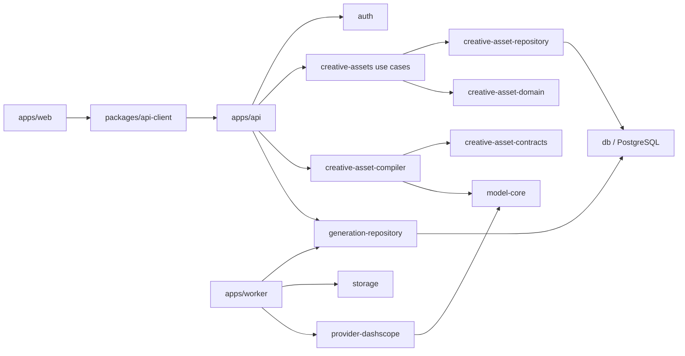

# 短剧素材平台目标架构

## 1. 文档状态

| 状态 | 含义 |
| --- | --- |
| 已确认 | 当前仓库、用户产品边界或个人规范已经明确的事实 |
| 目标 | 后续重构完成后应达到的边界 |
| 迁移中 | 已有实现可以工作，但还没有达到目标边界 |
| 未实现 | 本文只定义方向，尚未修改代码 |
| 待确认 | 会影响包边界、数据迁移或公开契约的最小决策 |

本文是创意资产平台的架构基线。它只负责“主体、场景、道具、风格和参考图等可复用素材”，不负责整条短剧的节奏、镜头取舍、剪辑和最终合片。

## 2. 结论摘要

### 已保留的仓库级选择

- **保留 `pnpm + Node + Turborepo`**：当前仓库已经使用 `pnpm@10.9.0`、Node 24 下限和 `pnpm-lock.yaml`，属于已有稳定项目。个人规范允许既有项目保留兼容链路，不为了偏好强行切换到 Bun。
- **保留 `apps/api`、`apps/web`、`apps/worker`**：目录已经符合 HTTP 服务、Web 客户端和后台消费者的职责划分，不新增 `apps/server`。
- **保留 PostgreSQL + Docker Compose**：项目是多进程、需要历史/恢复/审计的服务，当前数据库和迁移链路已经运行，不改成 SQLite。
- **保留 Biome、Elysia、Drizzle、Zod 和现有 Vitest**：现有工具链已经形成稳定约定；测试 runner 后续可以按领域逐步评估 Bun test，但本次不做全仓库迁移。

### 必须调整的边界

1. API 路由不再直接编排 `creative-asset-repository`，增加资产域 use case/service 层。
2. 创意资产协议不再继续扩张到万能的 `@bailian-studio/shared`；新边界使用明确的 `creative-asset-contracts` 和纯规则包。
3. 资产选择和模型能力适配由独立的纯函数 compiler 负责，不能塞进 API 路由、数据库 repository 或 DashScope provider。
4. 生成提交时固化“资产版本 + 参考图 + 模型能力 + 映射结果”的不可变快照；Worker 只消费快照，不在重试时重新读取用户当前资产版本。
5. Provider 仍然只负责协议执行、请求/响应解析和错误分类，不拥有资产语义，也不直接访问数据库。

## 3. 目标依赖关系



### 依赖规则

- `apps/api` 可以依赖 repository、domain、compiler 和 api-client contracts，但不能依赖 `db` 或 provider。
- `apps/worker` 可以依赖 generation repository、storage、model-core 和 provider runner，但不能依赖 API 或直接访问 `db`。
- `creative-asset-domain` 和 `creative-asset-compiler` 不读取环境变量、不访问数据库、不发 HTTP、不启动 listener。
- `creative-asset-repository` 只负责资产域持久化、事务和数据库不变量；不负责 HTTP、Provider、UI 和 prompt 编排。
- `provider-dashscope` 不依赖资产 repository、generation repository、Worker 或 API；资产输入必须已经被编译成 provider-neutral 的生成输入。
- `apps/web` 只通过 `packages/api-client` 访问资产 API，不 deep-import repository、db 或 app 源码。

## 4. 领域模型归属

| 概念 | 所属 | 语义 | 不负责什么 |
| --- | --- | --- | --- |
| `user_assets` | 物理媒体域 | 实际上传/生成的图片、视频、音频或文件 | 不表达“这是哪个角色” |
| `creative_assets` | 创意资产域 | 角色、场景、道具、风格等可复用语义实体 | 不等于单张图片 |
| `creative_projects` | 素材组织域 | 用户整理素材的项目/IP/短剧工作区 | 不负责剪辑时间线和镜头节奏 |
| `creative_project_assets` | 素材组织域 | 项目与资产的多对多归类关系 | 不代表资产所有权 |
| `creative_asset_versions` | 创意资产域 | 资产语义和生成配方的不可变版本 | 不原地覆盖已使用版本 |
| `creative_asset_references` | 参考资料域 | 版本所绑定的实际图片及其语义 role | 不依赖文件名和 UI 数组顺序 |
| `creative_generation_contexts` | 生成快照域 | 一次生成选择了哪些版本/参考图/模型能力 | 不作为资产库当前状态的镜像 |
| `director_projects` | 导演工作流域 | 未来的剧本、分镜、镜头和导演工作流 | 当前不与素材项目合并 |

项目只是检索和整理边界。资产可跨项目复用，资产的 ownership 仍然由用户决定；所有涉及资产引用的写入必须同时校验用户、项目、资产版本和参考图归属。

## 5. 生成链路的正确分层

用户的最小操作是“输入提示词 + 选择主体/场景/道具”，平台负责稳定引用，不替用户决定整条视频如何剪辑。

```text
用户选择素材
  ↓
API asset use case
  - 校验项目和资产 ownership
  - 只允许 approved 版本进入普通生成
  - 校验 role + position + referenceIds
  ↓
creative-asset-compiler（纯函数）
  - 读取模型 manifest 的能力和参数约束
  - 把语义 binding 映射到媒体参数
  - 生成 creativeContext、assetRefs 和不可变快照输入
  ↓
generation-repository
  - 与 generation record 一起原子持久化
  - 保存版本、参考图、模型能力、prompt 和 fingerprint
  - 使用 idempotency key 防止重复创建
  ↓
apps/worker
  - 从 generation_input_assets 读取物理资产坐标
  - 只在提交前生成短时效 URL
  - 交给 provider runner 执行、轮询、取消和重试
  ↓
生成结果
  - 结果归入历史和素材库
  - 用户自行比较、取舍、排列和合片
```

### 关键不变量

1. Worker 重试不能重新读取资产库的“当前 approved 版本”；它必须使用创建生成时的快照。
2. 资产版本和参考图一旦进入生成快照，就不能通过后续编辑改变历史语义。
3. `role + position` 是稳定槽位；`referenceIds` 是显式选择，不能隐式取版本下全部图片。
4. provider 能力不足时，在提交前返回结构化校验错误，不把失败推迟到 Worker 或外部模型。
5. Provider URL 只能由 Worker 的 storage 边界短时生成，数据库和浏览器不保存长期可访问凭据。
6. 生成编排不包含镜头排序、节奏判断、剪辑和最终合片决策。

## 6. 包与模块调整目标

### 6.1 `packages/creative-asset-contracts`（目标，未实现）

从当前 `packages/shared/src/creative-assets.ts` 提取以下稳定协议：

- 资产类型、资产/版本/项目状态和参考图 role。
- `CreativeAssetSemanticSpec`、`CreativeAssetReferenceMetadata`。
- `CreativeGenerationContext`、binding、协议版本和归一化函数。
- 创建/更新输入 schema 和对外响应 schema 的基础部分。

该包只依赖 Zod，不依赖 DB、API、Worker、Provider 或 UI。迁移完成后，`shared` 不再作为创意资产协议的事实来源；不保留两套 schema。

### 6.2 `packages/creative-asset-domain`（目标，未实现）

只放无 IO 的领域规则：

- 版本状态机和允许迁移。
- 资产类型与参考图 role 兼容性。
- approved/candidate/archive 准入规则。
- binding 去重、槽位归一化和错误 code。

数据库 constraint 仍然保留作为最后一道保护，但业务规则的可测试事实来源放在这里。

### 6.3 `packages/creative-asset-repository`（已实现，迁移中）

当前已实现项目、资产、版本、参考图的数据库读写和 ownership 防线。后续需要：

- 将纯状态/兼容性规则调用收敛到 `creative-asset-domain`。
- 把查询结果与写入输入继续保持领域类型，不向 API 暴露 Drizzle row。
- 保留分页、软删除、恢复和事务边界。
- 补齐并发冲突、唯一约束冲突和审计字段的稳定错误映射。

### 6.4 `apps/api/src/modules/creative-assets/service.ts`（目标，未实现）

该层是 HTTP 之外的应用编排：

- 接收认证后的 principal 和已解析输入。
- 调用 repository 完成项目/资产/版本 use case。
- 统一 ownership、状态、幂等、错误和审计动作。
- 为生成提交提供“已解析的 approved 版本和参考图快照”。

Elysia route 只做认证、Zod 入参、调用 use case 和响应整形；简单读取也通过同一个 facade，避免路由逐渐变成第二个 service。

### 6.5 `packages/creative-asset-compiler`（目标，未实现）

这是 provider-neutral 的纯编译层：

```text
CreativeGenerationRequest
  + resolved approved asset bindings
  + FrozenModelManifest
  → CompiledGenerationInput
```

输出至少包含：

- 规范化后的 `creativeContext`。
- generation repository 能持久化的 `assetRefs`/`generationInputAssets` 映射。
- 模型能力快照和可重放 fingerprint 输入。
- 结构化的 capability/parameter validation error。

它不包含 DashScope 字段名、HTTP endpoint、密钥、URL 签名和数据库查询。模型能力来自 `model-core` manifest，不能新增第二份模型参数表。

### 6.6 `packages/api-client`（目标，未实现）

新增项目/资产/版本/参考图 API 的 typed client 和 response schema。Web 页面只使用 client，不直接拼接 `/api/creative/*`，同时保留分页 cursor、搜索、空态、错误和恢复语义。

## 7. 当前实现与目标的差距

| 当前情况 | 问题 | 调整策略 |
| --- | --- | --- |
| creative asset route 直接调用 repository | 应用编排和 HTTP 适配混在一起 | 先加 service facade，再逐个迁移 route |
| 创意协议位于 `shared` | shared 逐渐成为万能包，领域边界变模糊 | 提取明确 contracts/domain 包，完成后删除旧事实来源 |
| generation repository 直接读取 creative 表做准入校验 | 生成持久化层承担了部分资产域规则 | 短期保留数据库事务防线；先让 compiler/service 负责正常路径，后续将校验收敛为可注入的快照准入接口 |
| `creativeContext` 已能持久化，但没有 compiler | API/前端未来会自行拼 provider 参数，容易产生漂移 | compiler 统一生成 provider-neutral 输入 |
| worker 已有物理资产 URL 解析 | 只能解决文件访问，不能解决语义资产映射 | 继续保留；它只消费 compiler 生成的持久化输入 |
| `api-client` 暂无创意资产 client | Web 无法稳定消费新 API | API 契约稳定后再补 client 和工作台 |
| `director_projects` 与 `creative_projects` 并存 | 名称都叫 project，容易误合并 | 明确为素材组织域与导演工作流域，暂不合表 |

## 8. 分阶段迁移顺序

### Phase 0：架构冻结（本阶段）

- 已确认保留 pnpm/Node/PostgreSQL/现有目录。
- 以本文作为资产域重构依据。
- 不改剧本、分镜、剪辑和导演流程。

### Phase 1：契约和纯规则收敛

- 提取 `creative-asset-contracts` 和 `creative-asset-domain`。
- 同步 `shared`、generation repository、API 和测试的 import。
- 保持协议版本 1，禁止同时维护两套 schema。

### Phase 2：API 应用层和 API Client

- 增加 `creative-assets/service.ts`。
- 让路由只保留认证、输入校验和响应适配。
- 在 `packages/api-client` 增加项目/资产/版本/参考图 client。
- 暂不改 Web 视觉，先接通真实数据、加载、空态、错误和分页。

### Phase 3：Provider-neutral compiler

- 根据真实 model manifest 建立能力映射和媒体参数映射。
- 将资产版本和参考图编译为生成快照输入。
- 先用纯函数测试覆盖角色/场景/道具、多参考图、超限、缺失能力和幂等指纹。

### Phase 4：生成事务收敛

- 让生成提交使用 compiler 结果。
- 保留 generation repository 的数据库事务和历史快照能力。
- 逐步移除其对创意资产“当前状态查询”的业务编排，只保留必要的原子持久化和防御性校验。

### Phase 5：素材工作台

- Web 端按“项目 → 资产类型 → 资产版本 → 参考图”组织浏览。
- 支持项目筛选、搜索、分页、版本状态、归档恢复和引用生成。
- 长列表达到阈值后使用虚拟滚动，但保留 cursor 分页和失败重试。
- 只有页面交互稳定后，才考虑 Playwright 页面级测试。

### Phase 6：剧本能力（未来，不在当前范围）

- 剧本上传/生成、人物风格分析、场景和道具提示词生成作为独立的剧本域。
- 剧本只消费素材域的 contracts 和 project 组织关系，不反向拥有资产版本状态机。
- 不把剧本分析扩散进素材 repository 或 Provider executor。

## 9. 明确不做的事情

- 不实现“一键生成整条短剧”的自动导演流程。
- 不由 AI 决定视频节奏、镜头切换、镜头取舍或最终合片。
- 不把 `creative_projects` 改造成 `director_projects` 的别名。
- 不为了个人偏好把当前 pnpm 项目强制迁移到 Bun。
- 不在 `model-core`、asset compiler、API 或 Worker 中复制 Provider 参数、价格或 endpoint 表。
- 不把用户上传媒体、生产数据库、备份和运行时文件放回 Git checkout。
- 不在本阶段新增真实 Provider 调用或公开部署验收声明。

## 10. 待确认的最小问题

推荐默认采用本文的两步包拆分：`creative-asset-contracts` + `creative-asset-domain`，随后再加 API service 和 compiler。这样可以先解决“万能 shared”和“route 直接调 repository”两个维护问题，再进入 Provider 映射。

唯一需要用户确认的是：是否接受在下一次代码变更中，把创意资产协议从 `@bailian-studio/shared` 提取为独立包，并同步迁移现有引用。接受后，后续所有资产、场景、道具和未来剧本分析相关协议都以独立 contracts 为唯一来源。
