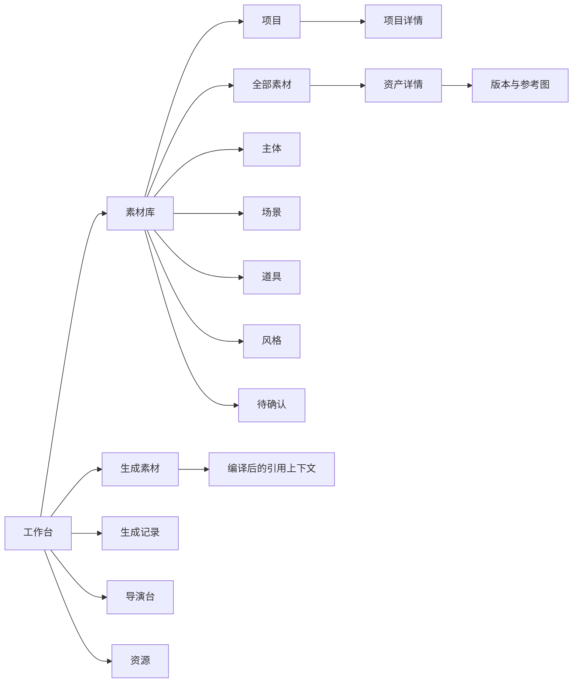

# Web 资产工作台页面线框

状态：设计阶段，只定义页面结构、交互边界和验收条件，不代表已经开始页面实现。

## 1. 设计目标

Web 资产工作台服务于“按项目整理素材，并将确认版本稳定地引用到下一次生成”的任务。

用户不需要在这里完成整部短剧的剪辑、镜头切换或节奏编排。页面只负责：

- 找到正确的项目和素材。
- 明确素材类型、版本和状态。
- 预览和比较参考图。
- 选择已批准版本进入生成。
- 回溯素材的生成来源和引用关系。

## 2. 信息架构



一级导航只保留工作概念，资产类型放在素材库的局部导航中。

## 3. 应用外壳与侧边栏

### 展开态

```text
┌──────────────────────┬─────────────────────────────────────────────────────┐
│  BL Studio           │ 当前项目：全部项目        搜索 / 命令             │
│  [项目选择器]         ├─────────────────────────────────────────────────────┤
│                      │                                                     │
│  工作台               │                                                     │
│  素材库               │                  页面内容区域                       │
│  生成素材             │                                                     │
│  生成记录             │                                                     │
│  导演台               │                                                     │
│  资源                 │                                                     │
│                      │                                                     │
│  ─────────────────   │                                                     │
│  通知                 │                                                     │
│  积分                 │                                                     │
│  账户                 │                                                     │
└──────────────────────┴─────────────────────────────────────────────────────┘
```

### 折叠态

```text
┌────────┬────────────────────────────────────────────────────────────────────┐
│  BL    │ 当前项目：全部项目                         页面标题 / 操作         │
│  ◈     │                                                                    │
│  ▣     │                                                                    │
│  ✦     │                                                                    │
│  ◫     │                         页面内容                                   │
│  ▤     │                                                                    │
│  ⚙     │                                                                    │
│        │                                                                    │
│  ◉     │                                                                    │
│  ◎     │                                                                    │
└────────┴────────────────────────────────────────────────────────────────────┘
```

折叠态要求：

- 每个图标有 tooltip、`aria-label` 和当前状态。
- 当前项目选择器不被隐藏，至少保留项目名称或项目色标。
- 不把资产类型压缩成用户无法理解的图标集合。
- `Ctrl/Cmd + K` 打开全局搜索和命令面板。

## 4. 工作台首页 `/workbench`

```text
┌─────────────────────────────────────────────────────────────────────────────┐
│ 工作台                         [全部项目 ▾]                 [创建素材]       │
├─────────────────────────────────────────────────────────────────────────────┤
│ 最近项目                                                                  │
│ ┌──────────────┐ ┌──────────────┐ ┌──────────────┐  [查看全部项目]          │
│ │ 项目封面      │ │ 项目封面      │ │ 项目封面      │                         │
│ │ 夜班便利店    │ │ 雨夜追踪      │ │ 未命名项目    │                         │
│ │ 24 个素材     │ │ 12 个素材     │ │ 0 个素材      │                         │
│ └──────────────┘ └──────────────┘ └──────────────┘                         │
├─────────────────────────────────────────────────────────────────────────────┤
│ 最近使用的素材                         [素材库]                             │
│ [主体缩略图] [场景缩略图] [道具缩略图] [主体缩略图]                         │
├─────────────────────────────────────────────────────────────────────────────┤
│ 生成中的任务                            待确认素材                          │
│ 任务名称  状态  已用资产                  林默-v3      [确认]                 │
│                                           旧仓库-v2    [查看]                 │
└─────────────────────────────────────────────────────────────────────────────┘
```

首页不做统计大屏。点阵背景只允许出现在顶部空白区或无项目状态，不进入缩略图区域。

## 5. 素材库 `/assets`

```text
┌─────────────────────────────────────────────────────────────────────────────┐
│ 素材库                         [全部项目 ▾]             [上传] [新建素材]     │
│ 搜索素材、项目或提示词 [________________________]   [筛选] [排序] [▦][☷]     │
├─────────────────────────────────────────────────────────────────────────────┤
│ 全部素材   项目   主体   场景   道具   风格   待确认                         │
├─────────────────────────────────────────────────────────────────────────────┤
│ 筛选： [类型 ▾] [状态 ▾] [来源 ▾] [有参考图 ▾]       共 128 个素材           │
├─────────────────────────────────────────────────────────────────────────────┤
│ ┌────────────┐ ┌────────────┐ ┌────────────┐ ┌────────────┐                   │
│ │            │ │            │ │            │ │            │                   │
│ │  媒体预览  │ │  媒体预览  │ │  媒体预览  │ │  媒体预览  │                   │
│ │            │ │            │ │            │ │            │                   │
│ ├────────────┤ ├────────────┤ ├────────────┤ ├────────────┤                   │
│ │ 林默       │ │ 旧仓库     │ │ 黑手提箱   │ │ 冷调写实   │                   │
│ │ 主体·v3    │ │ 场景·v2    │ │ 道具·v1    │ │ 风格       │                   │
│ │ 已确认     │ │ 待确认     │ │ 夜班便利店 │ │ 3 个项目   │                   │
│ └────────────┘ └────────────┘ └────────────┘ └────────────┘                   │
│                                                                             │
│                         [加载更多]                                          │
└─────────────────────────────────────────────────────────────────────────────┘
```

### 素材库交互规则

- 默认网格，列表视图作为补充；不再用一个下拉框混合“网格、时间线、项目”三种完全不同的概念。
- `项目`是局部页签，点击后进入项目列表，不把同一次生成的 recordId 误称为项目。
- 搜索、筛选、排序、视图和当前项目写入 URL。
- 点击缩略图打开预览，点击名称或详情操作进入资产详情。
- 多选后显示批量操作栏：移入项目、加标签、归档、下载。
- 大量素材使用现有虚拟滚动基础，继续保留“加载更多”作为明确的分页边界。

## 6. 项目列表与项目详情

### 项目列表 `/assets/projects`

```text
┌─────────────────────────────────────────────────────────────────────────────┐
│ 项目                              [搜索项目]             [新建项目]           │
├─────────────────────────────────────────────────────────────────────────────┤
│ ┌──────────────────┐  ┌──────────────────┐  ┌──────────────────┐             │
│ │ 项目封面          │  │ 项目封面          │  │ 空项目占位        │             │
│ │ 夜班便利店        │  │ 雨夜追踪          │  │ 新短剧项目        │             │
│ │ 24 个素材 · 3 个版本 │ 12 个素材 · 最近使用 │ 0 个素材          │             │
│ └──────────────────┘  └──────────────────┘  └──────────────────┘             │
└─────────────────────────────────────────────────────────────────────────────┘
```

### 项目详情 `/assets/projects/:projectId`

```text
┌─────────────────────────────────────────────────────────────────────────────┐
│ 素材库 / 夜班便利店                         [项目设置] [生成素材]             │
│ 夜班便利店   24 个素材   3 个待确认   最近更新：今天                         │
├─────────────────────────────────────────────────────────────────────────────┤
│ 全部   主体   场景   道具   风格   生成记录   待确认                          │
├─────────────────────────────────────────────────────────────────────────────┤
│ [搜索项目素材]                  [类型 ▾] [状态 ▾] [添加已有素材]              │
├─────────────────────────────────────────────────────────────────────────────┤
│ 项目内素材网格，复用素材库的 Asset Tile                                       │
└─────────────────────────────────────────────────────────────────────────────┘
```

## 7. 资产详情 `/assets/:assetId`

```text
┌─────────────────────────────────────────────────────────────────────────────┐
│ 素材库 / 夜班便利店 / 林默-v3                                  [更多 ▾]        │
├───────────────────────────────┬─────────────────────────────────────────────┤
│                               │ 林默                                           │
│                               │ 主体 · 已确认 · 当前版本 v3                   │
│          大图预览             │ 所属项目：夜班便利店、雨夜追踪                 │
│                               │ [生成新版本] [复制资产] [归档资产]              │
│                               ├─────────────────────────────────────────────┤
│                               │ 版本                                             │
│                               │ v3 已确认   v2 候选   v1 草稿                  │
│                               │ [打开版本时间线]                               │
│                               ├─────────────────────────────────────────────┤
│                               │ 参考图（4）                                     │
│                               │ [正面] [侧面] [表情] [服装] [添加参考图]          │
│                               ├─────────────────────────────────────────────┤
│                               │ 使用记录                                         │
│                               │ 被 6 次生成引用 · 被 2 个项目使用                │
└───────────────────────────────┴─────────────────────────────────────────────┘
```

资产详情中的版本状态必须支持：草稿、生成中、候选、已确认、已归档、失败。批准动作需要明确写成“确认 v3 为当前版本”，不能只用一个勾选图标。

## 8. 生成素材 `/create`

```text
┌─────────────────────────────────────────────────────────────────────────────┐
│ 生成素材                   项目：[夜班便利店 ▾]                 [保存预设]     │
├─────────────────────────────┬───────────────────────────┬───────────────────┤
│ 提示词                      │ 资产引用                  │ 生成与预估         │
│                             │                           │                   │
│ [描述要生成的素材……       ]│ 主体                       │ 模型 [自动 ▾]      │
│                             │ [林默-v3]                  │ 尺寸 [9:16 ▾]      │
│ @林默-v3 在旧仓库……        │                           │                   │
│                             │ 场景                       │ 预计消耗           │
│ [高级参数 ▾]                │ [旧仓库-v2]                │                   │
│                             │                           │ [生成素材]         │
│                             │ 道具                       │                   │
│                             │ [黑手提箱-v1]              │                   │
│                             │                           │                   │
│                             │ [添加主体] [添加场景]      │                   │
└─────────────────────────────┴───────────────────────────┴───────────────────┘
```

生成页的关键不是增加更多参数，而是让用户在提交前看清：

- 当前项目。
- 每个资产槽位引用的资产。
- 引用的具体版本。
- 每张参考图的角色。
- 用户提示词和平台编译后的引用关系。

## 9. 生成详情 `/generations/:id`

```text
┌─────────────────────────────────────────────────────────────────────────────┐
│ 生成记录 / 2026-08-25  林默场景尝试                           [再次生成]       │
├───────────────────────────────┬─────────────────────────────────────────────┤
│ 结果预览                       │ 生成上下文                                   │
│ [结果 1] [结果 2] [结果 3]     │ 项目：夜班便利店                             │
│                               │ 主体：林默-v3                                │
│                               │ 场景：旧仓库-v2                              │
│                               │ 道具：黑手提箱-v1                            │
│                               │ 模型：……                                     │
│                               │ 原始提示词：……                              │
│                               │ 编译引用：……                                │
│                               │ [保存为新资产版本]                           │
└───────────────────────────────┴─────────────────────────────────────────────┘
```

生成详情可以保存结果为资产，但不能自动把所有结果变成“已确认资产”。用户必须选择结果、命名资产并确认版本。

## 10. 响应式行为

### 大屏，>= 1440px

- 侧边栏展开。
- 素材库显示 4–6 列，右侧可打开详情检查器。
- 生成页保持三栏结构。

### 工作台宽度，1024–1439px

- 侧边栏可以折叠为图标 rail。
- 素材库显示 3–4 列。
- 资产详情使用右侧抽屉或独立路由，不挤压主网格。
- 生成页由三栏变为“提示词 + 资产引用”与“提交摘要”上下结构。

### 紧凑屏幕，< 768px

- 侧边栏变为 sheet。
- 当前项目和搜索保持在页面顶部。
- 素材库显示 2 列，信息卡只保留名称、类型和状态。
- 资产详情改为单列：预览、状态、版本、参考图、使用记录。
- 生成页按“提示词 → 资产引用 → 参数 → 提交”顺序堆叠。

## 11. 状态与可访问性验收

- 空项目：解释项目用途，并提供“上传素材”“新建主体”“开始生成”三个动作。
- 空筛选结果：显示当前筛选条件，并提供“一键清除筛选”。
- 上传中：缩略图位置保留骨架，显示上传进度和取消操作。
- 生成中：显示任务状态，不覆盖用户提示词和已选资产。
- 生成失败：保留所有输入，提供“重试”和“返回修改参数”。
- 待确认：除颜色外，同时显示“待确认”文字和明确操作按钮。
- 键盘：所有导航、筛选、资产选择、版本确认和弹层均可通过 Tab、Enter、Escape 完成。
- 焦点：使用可见 focus ring，不使用只改变背景色的隐性焦点。
- 点阵背景：`aria-hidden=true`，不参与读屏顺序，不影响鼠标和键盘事件。

## 12. 实施边界

本线框阶段不实现：

- 剧本上传与剧本分析。
- 自动生成整部短剧分镜。
- 自动合并视频、剪辑、节奏和镜头切换。
- 把导演台改造成自动导演流程。
- 在没有 fallback 的情况下引入 TypeGPU。

后续页面重构应按照“应用外壳与导航 → 素材库 → 项目详情 → 资产详情 → 生成引用上下文 → 生成记录”的顺序进行。
